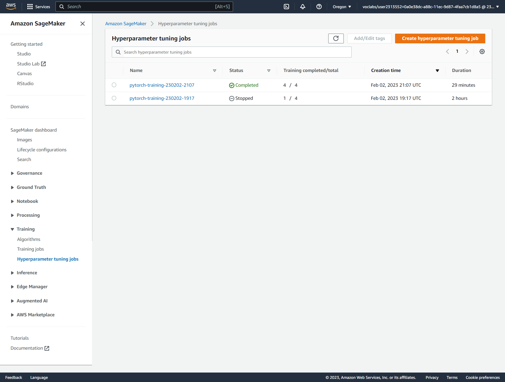

# Image Classification using AWS SageMaker

Use AWS Sagemaker to train a pretrained model that can perform image classification by using the Sagemaker profiling, debugger, hyperparameter tuning and other good ML engineering practices. This can be done on either the provided dog breed classication data set or one of your choice.

## Project Set Up and Installation
Enter AWS through the gateway in the course and open SageMaker Studio. 
Download the starter files.
Download/Make the dataset available. 

## Dataset
The provided dataset is the dog breed classification dataset found in the classroom. The project is designed to be dataset-independent, so feel free to use a more relevant or interesting dataset.

## Access
Upload the data to an S3 bucket through the AWS Gateway so SageMaker can access it.

## Overview of Project Steps
The "train_and_deploy.ipynb" Jupyter notebook walks through the implementation of an image classification machine learning model to classify between 133 types of dog breeds using the dog breed dataset provided by Udacity (https://s3-us-west-1.amazonaws.com/udacity-aind/dog-project/dogImages.zip).

- Use a pretrained ResNet50 model from PyTorch vision library.
- Add two fully connected neural network layers on top of the ResNet50 model.
Note: The project uses transfer learning, so all existing convolutional layers in the ResNet50 model are frozen, and only the gradients for the two added fully connected layers are changed.
- Perform hyperparameter tuning to determine the best hyperparameters for the model.
- Fine-tune the ResNet50 model using the best hyperparameters.
- Add profiling and debugging configuration to the training and testing phases by adding relevant hooks.
- Deploy the model and create a custom inference script for the deployed endpoint.
- Test the model with test images of dogs to verify it works as expected.

## Files Summary 

- **hpo.py** - Contains code used by hyperparameter tuning jobs to train and test/validate models with different hyperparameters.

- **train_model.py** - Contains code used by the training job to train and test/validate the model with the best hyperparameters from tuning.

- **train_model.py** - Contains code used by the training job to train and test/validate the model with the best hyperparameters from tuning.
  
- **endpoint_inference.py** - Contains code used by the deployed endpoint for preprocessing, serialization/deserialization, predictions/inferences, and post-processing using the saved model from the training job.

- **train_model.py** - Contains code used by the training job to train and test/validate the model with the best hyperparameters from tuning.
  
- **train_and_deploy.ipynb** - Contains all code and steps performed in the project and their outputs.

## Hyperparameter Tuning

- For this image classification problem, we are using a ResNet50 model with two fully connected linear neural network layers. The ResNet-50 model has a deep architecture, consisting of 50 layers and is trained on a million images from 1000 categories in the ImageNet database. The model has a large number of trainable parameters, making it ideal for image recognition. The optimizer used for the model is AdamW, which can be found in the PyTorch documentation. During tuning, the following hyperparameters were considered: the learning rate, which ranges from 0.01 to 100 times the default of 0.001; the eps, which ranges from 1e-09 to 1e-08; the weight decay, which ranges from 0.1 to 10 times the default of 0.01; and the batch size, which was limited to either 64 or 128.

- # Completed training jobs
  
  

- # Logs metrics during the training process
- 
  

- # Hyperparameters Training Jobs

 

- # The best hyperparameters from all training jobs

 

## Debugging and Profiling

### The training and validation/testing process was monitored by setting a Debugger hook to track the Loss Criterion metrics. The plot of the Cross entropy loss is presented below : 

 

 ### I would go about fixing the anomalous behavior by making some adjustments to the pretrained ResNet50 model. My goal is to smoothen out the graph, and I believe this can be achieved by using a different set of fully connected layers in the model. If I had more AWS credits, I would try changing the fc layers used in the model. Firstly, I would try adding an additional fc layer on top of the existing two layers, and observe the results. If this doesn't yield significant improvement, I would consider removing all the fc layers and retaining only one fc layer in the model. Then, I would rerun the tuning and training processes to check the outputs.

## Results

### The outcome appears to be satisfactory as the GPU was employed during the hyperparameter tuning and training of the ResNet50 model. The "ml.p3.2xlarge" instance type was utilized for the training process, while cost and resources were conserved during deployment by using the "ml.t2.medium" instance type.

## Model Deployment

### We deployed the model on a "ml.p3.2xlarge" instance using the "endpoint_inference.py" script. To test the deployed model, we will be using test images stored in the "testImages" folder. We will be sending these images as inputs to the endpoint by using two methods: firstly, by using the Predictor class object and secondly, by using the boto3 client :

## Output From The Endpoint

